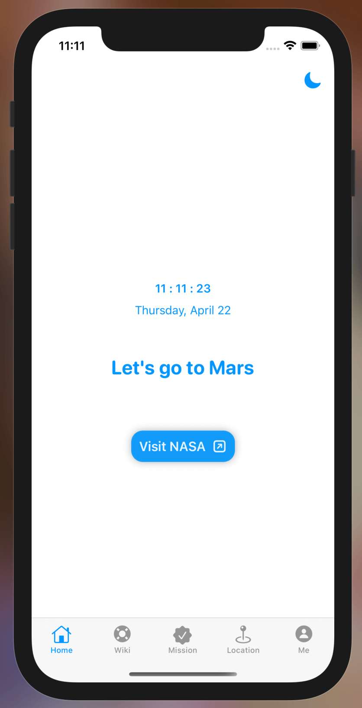
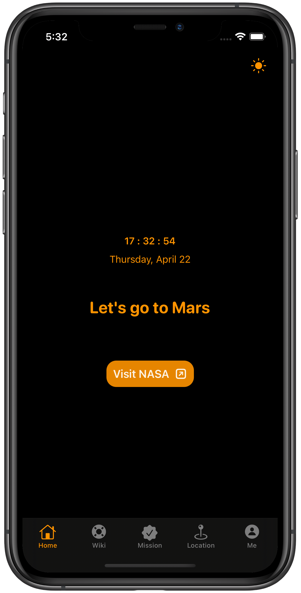
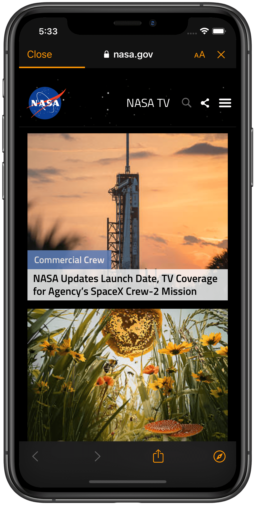
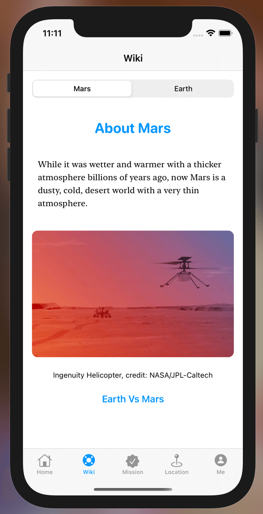
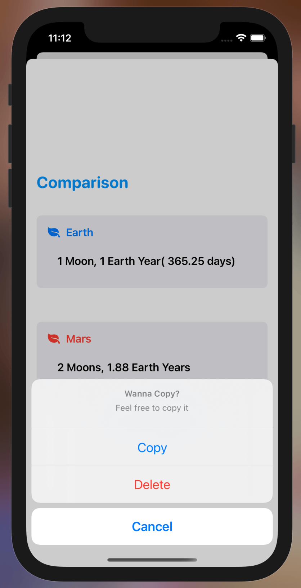
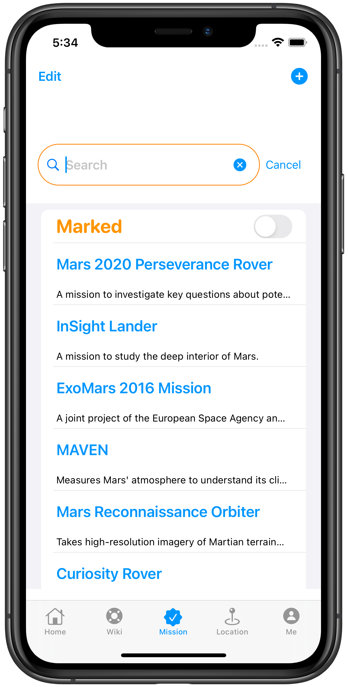
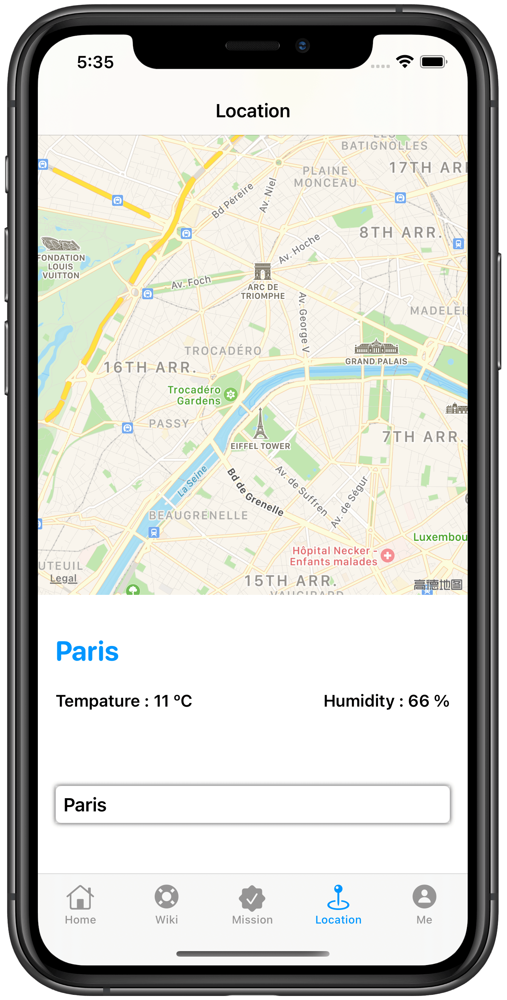
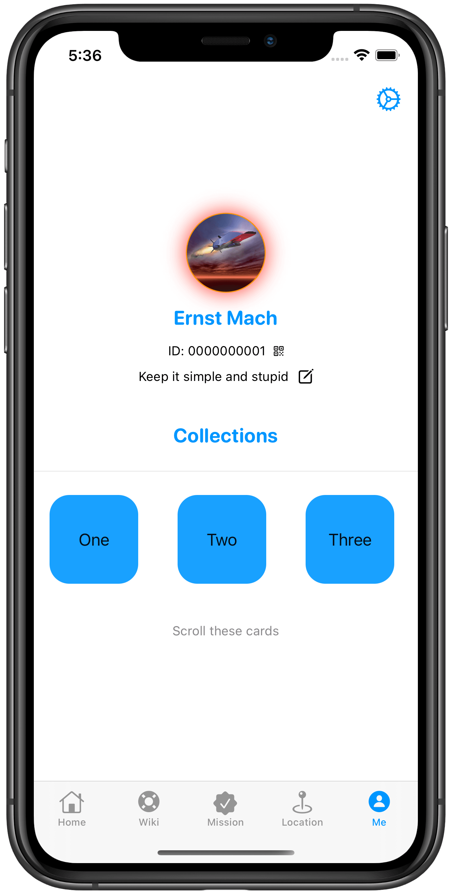
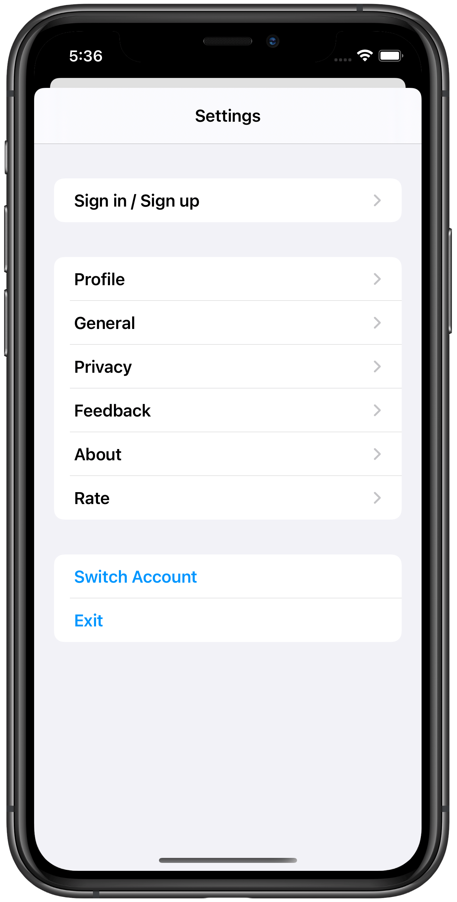

# ioswiftui

This a open source project for Swift and SwiftUI test.

## Frameworks

Foundation、SwiftUI / UIKit、Combine、Core Location、WidgetKit、BetterSafariService.

<figure align="center"> 
    
</figure>

​	

